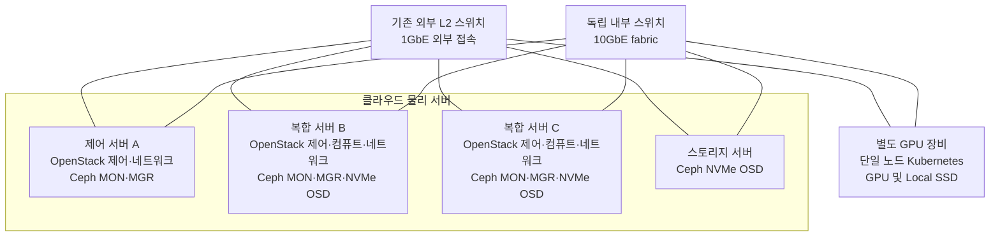

# 하드웨어 구조도

역할 기반 별칭이며 물리 포트 번호와 실제 주소를 생략했습니다. 선은 연결 관계로, 화살표 방향의 통신 제한이나 서버별 처리 속도를 뜻하지 않습니다. 내부 스위치의 10GbE 표기를 GPU 장비 NIC 속도로 일반화하지 않습니다.

- 서버별 CPU·RAM·NIC·SSD 보유 현황을 고려해 역할을 배분했습니다.
- 제어 서버 A의 추가 compute 역할은 후속 검토·설계 범위이므로 현재 compute로 그리지 않았습니다.
- Ceph MON/MGR와 OSD의 위치가 다르며, NVMe OSD는 복합 서버 B·C와 스토리지 서버에 분산됩니다.
- HDD 클러스터나 미편입 후보 서버는 이 도식에 포함하지 않았습니다.
- 서버별 VLAN 멤버십은 같지 않습니다. Octavia 관리 VLAN은 [네트워크 구조도](04-network.md)에서 별도로 표시합니다.
