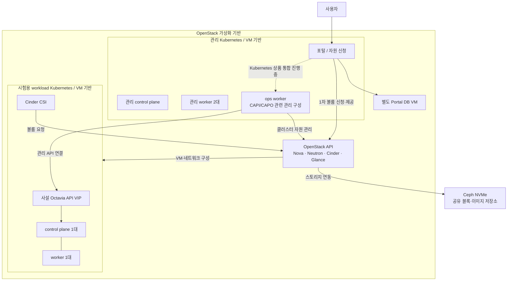

# OpenStack–Kubernetes 내부 구조도

관리 Kubernetes와 사용자에게 제공할 workload Kubernetes는 서로 다른 클러스터입니다. 아래는 논리 구성으로 VM의 개별 물리 호스트 배치를 나타내지 않습니다.

시험용 두 노드 Ready와 Cinder CSI 볼륨 수명주기를 검증했습니다. 포털 통합의 점선은 서비스 전체가 아직 진행 중임을 나타냅니다. API와 Ceph를 연결한 선은 서비스 연동 관계이며 실제 데이터가 모든 OpenStack API를 차례로 통과한다는 뜻은 아닙니다.

Octavia의 사설 API VIP 네트워크와 Amphora 관리망은 서로 다릅니다. 이 도식에는 서비스 API 경로만 표시했습니다.
