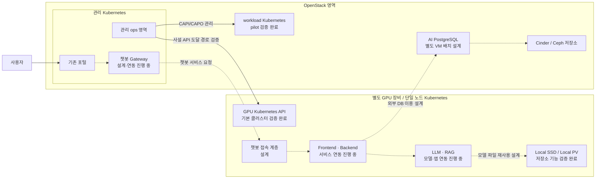

# OpenStack–Kubernetes–GPU 연계 구조도

GPU Kubernetes는 물리 장비 위의 독립 클러스터입니다. Nova compute, CAPO Machine 또는 기존 관리 Kubernetes worker가 아닙니다.

- 실선의 API 경로 검증은 관리 시스템의 등록·배포·모니터링 전체 통합 완료가 아닙니다.
- 점선으로 그린 서비스 구성은 설계·통합 진행 중입니다. AI DB와 모델 배포 완료로 읽지 않습니다.
- 본인은 전체 서비스와 인프라 연계 구조를, 협업 구성원 1명은 LLM 관련 설계를 담당합니다.
- Local SSD는 모델 재사용 시 반복적인 원격 전송을 줄이려는 선택이며 DB 통신까지 제거하지 않습니다.
- 단일 GPU 노드 장애에 대한 고가용성을 주장하지 않습니다.
