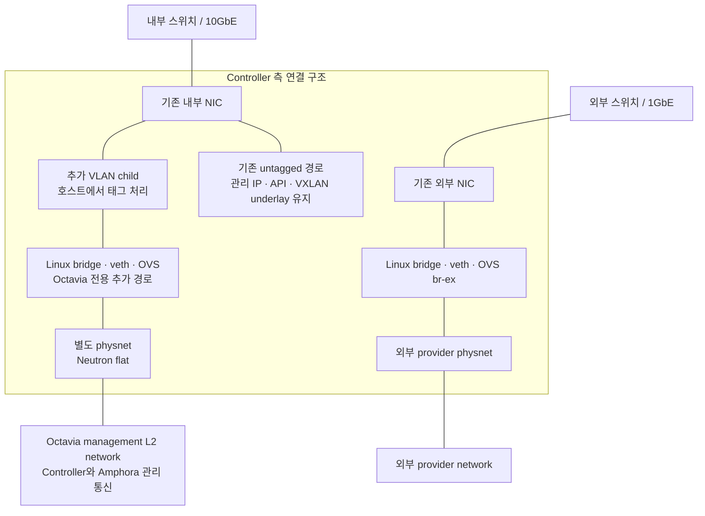
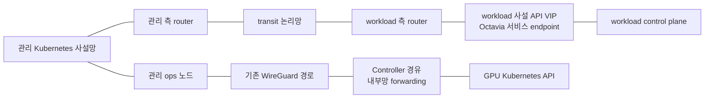

# 네트워크 구조도

실제 NIC 이름·주소·스위치 포트·VLAN 번호는 생략했습니다. 물리망과 Neutron 논리망, 관리 연결과 서비스 연결을 구분합니다.

## 물리·호스트 네트워크

기존 외부망의 Linux bridge·veth·OVS 연결 형태를 참고해 내부망에 필요한 VLAN 경로만 추가했습니다. 기존 관리 IP를 옮기지 않고 관리·VXLAN 통신과 외부망 설정을 유지했습니다. VLAN child에서 태그를 처리하므로 Neutron에서는 flat으로 연결합니다.

## 관리 클러스터·사용자 클러스터·GPU API 경로

- workload API는 Floating IP 대신 사설 Octavia VIP로 연결했습니다.
- 이 VIP가 속한 테넌트 네트워크는 위의 Octavia management L2 network와 다릅니다.
- GPU API의 지정된 경로는 검증했지만 모든 네트워크 도달성·권한·장애 복원을 검증한 것은 아닙니다.
- 보안 그룹·호스트 방화벽과 왕복 경로 설정은 해당 연결의 구성 요소입니다. 위 선은 방화벽 전체 허용을 뜻하지 않습니다.
- GPU 챗봇 사용자의 요청 경로는 별도의 [서비스 연계 설계도](03-openstack-kubernetes-gpu.md)에서 점선으로 구분했습니다.
